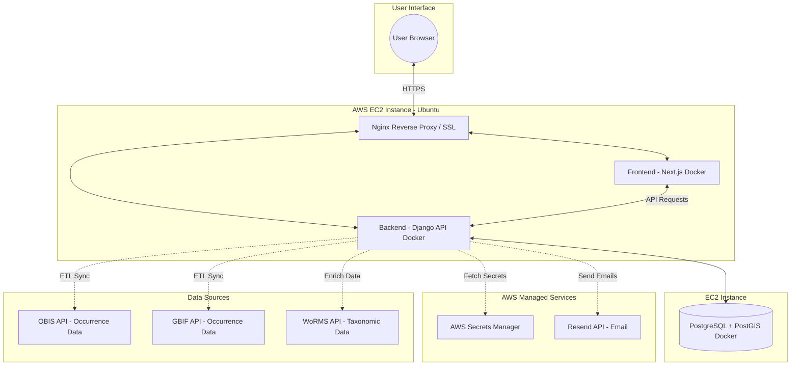
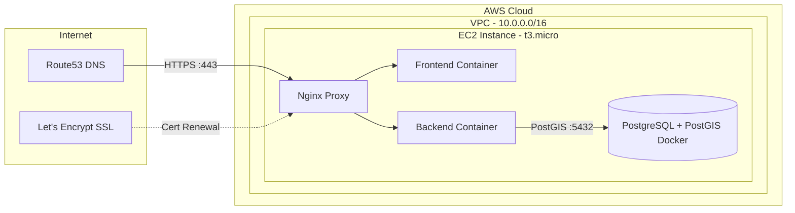

# Marine Species Observation Tracker

Empower divers, biologists, and hobbyists to log, explore, and contribute to marine species observations—all on an interactive map. This platform bridges citizen science and professional research, making it easy to track biodiversity, share discoveries, and access verified species data from global databases.

## Project Overview

The Marine Species Tracker is a full-stack application designed to facilitate the collection, management, and visualization of marine species observation data. It consists of a robust Django backend, a dynamic Next.js frontend, and a cost-effective AWS infrastructure for deployment.



## Architecture & Tech Stack

This project is structured as a monorepo, managed end-to-end with Docker Compose for seamless development and deployment.

### Frontend (Next.js, React, TypeScript)

The frontend provides the user-facing interface for interacting with the application.

- **User Interface**: Built with **Next.js** and **React** in **TypeScript**, using **Radix UI** components for accessibility and **Tailwind CSS** for styling.
- **Interactive Mapping**: An interactive map powered by **Leaflet** displays marine species observations with custom markers and popups based on observation status and source.
- **Authentication Flow**: Protects most application routes using Next.js middleware and an Axios client configured for secure, cookie-based JWT authentication with automatic token refreshing.
- **Observation Management**: Allows users to add, edit, and view marine species observations with detailed information and geographic locations.

### Backend (Django, GeoDjango, PostGIS)

The backend handles data storage, business logic, and external API integrations.

- **API & Data Management**: A **Django REST API** handles all data operations, featuring a custom user model with role support and secure JWT (cookie-based) authentication.
- **Geospatial Database**: Leverages **PostgreSQL** with the **PostGIS** extension for efficient storage and querying of geospatial observation data.
- **ETL Pipeline**: Fetches and curates marine species occurrence data from **OBIS** and **GBIF**, enriched with taxonomic information from the **WoRMS API**.
- **Security**: Authentication enforced server-side using HttpOnly JWT cookies.

### Infrastructure (AWS, Terraform, Docker)



- **Cloud Provider**: AWS — single EC2 instance running both frontend and backend Docker containers.
- **Infrastructure as Code**: **Terraform** provisions all AWS resources (VPC, subnets, EC2, Route53, security groups, IAM roles, Secrets Manager).
- **Containerization**: **Docker** and **Docker Compose** ensure consistent environments across development and production.
- **Security & Monitoring**: Nginx with **Let's Encrypt SSL**, AWS Secrets Manager for credentials, and CloudWatch for monitoring.
- **Automated Tasks**: Cron jobs in `scripts/` keep external species data up-to-date via scheduled ETL runs.

---

## Quick Start (Local Development)

### Prerequisites

- Docker and Docker Compose installed and running.

### Start All Services

1. **Clone the repository:**
    ```sh
    git clone https://github.com/your-repo/marine-species-tracker.git
    cd marine-species-tracker
    ```

2. **Build and start all services:**
    ```sh
    docker-compose up --build
    ```
    - Backend: [http://localhost:8000](http://localhost:8000)
    - Frontend: [http://localhost:3000](http://localhost:3000)

3. **Run backend migrations and create a superuser:**
    ```sh
    docker-compose exec backend python manage.py migrate
    docker-compose exec backend python manage.py createsuperuser
    ```

### Running Backend Commands (Inside Docker)

All Django commands must be run inside the backend container:

```sh
docker-compose exec backend python manage.py <command>

# Example: run tests
docker-compose exec backend pytest
```

### Accessing Services

| Service | URL |
|---|---|
| Frontend | [http://localhost:3000](http://localhost:3000) |
| Backend API | [http://localhost:8000](http://localhost:8000) |
| Django Admin | [http://localhost:8000/admin](http://localhost:8000/admin) |
| API Docs (Swagger) | [http://localhost:8000/api/docs/](http://localhost:8000/api/docs/) |
| Postgres shell | `docker-compose exec db psql -U postgres -d marine_tracker` |

---

## Project Structure

```
marine-species-tracker/
├── backend/            # Django REST API (Python, GeoDjango, PostGIS)
├── frontend/           # Next.js application (TypeScript, React)
├── infra/              # Terraform configurations and deployment scripts (AWS)
├── scripts/            # Shell scripts for ETL sync and deployment automation
├── docker-compose.yml  # Orchestrates local development services
└── README.md           # This overview
```

For detailed documentation, see:
- [Backend README](backend/README.md)
- [Frontend README](frontend/README.MD)
- [ETL Pipeline README](backend/species/ETL_README.MD)
- [Infrastructure README](infra/README.MD)

---

## Contributing

1. Fork the repository
2. Create a feature branch (`git checkout -b feature/amazing-feature`)
3. Commit your changes (`git commit -m 'Add amazing feature'`)
4. Push to the branch (`git push origin feature/amazing-feature`)
5. Open a Pull Request

## License

This project is licensed under the **AGPL-3.0 License** — see the `LICENSE` file for details.
