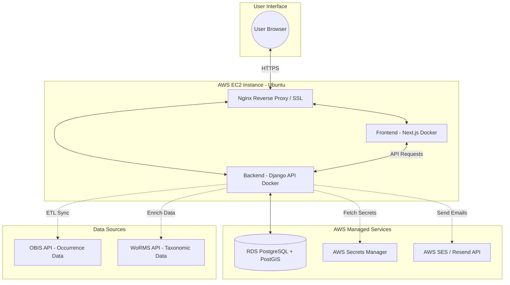
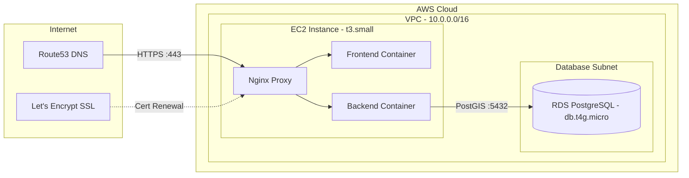

# 🐋 Marine Species Observation Tracker

Empower divers, biologists, and hobbyists to log, explore, and contribute to marine species observations—all on an interactive map. This platform bridges citizen science and professional research, making it easy to track biodiversity, share discoveries, and access verified species data from global databases.

## 🚀 Project Overview

The Marine Species Tracker is a full-stack application designed to facilitate the collection, management, and visualization of marine species observation data. It consists of a robust Django backend, a dynamic Next.js frontend, and a cost-effective AWS infrastructure for deployment.



## 🏗️ Architecture & Tech Stack

This project is structured as a monorepo, managed end-to-end with Docker Compose for seamless development and deployment.

### 🌐 Frontend (Next.js, React, TypeScript)

The frontend provides the user-facing interface for interacting with the application. It's built on a modern stack to ensure a responsive and intuitive user experience.

*   **User Interface**: Developed with **Next.js** and **React** in **TypeScript**, utilizing **Radix UI** components for accessibility and **Tailwind CSS** for flexible styling.
*   **Interactive Mapping**: Features an interactive map powered by **Leaflet** that displays marine species observations dynamically, with custom markers and popups based on observation status and source.
*   **Authentication Flow**: Protects most application routes, requiring user authentication. It uses Next.js middleware and an Axios client configured for secure, cookie-based JWT authentication, including automatic token refreshing.
*   **Observation Management**: Allows users to add, edit, and view marine species observations with detailed information and geographic locations.

### ⚙️ Backend (Django, GeoDjango, PostGIS)

The backend serves as the powerful engine behind the application, handling data storage, business logic, and external API integrations.

*   **API & Data Management**: A **Django REST API** handles all data operations, featuring a custom user model with role support and secure JWT (cookie-based) authentication.
*   **Geospatial Database**: Leverages **PostgreSQL** with the **PostGIS** extension for efficient storage and querying of geospatial observation data.
*   **External Data Integration (ETL)**: Includes an Extract, Transform, Load (ETL) pipeline to fetch and curate marine species occurrence data from external sources like **OBIS API** and enrich it with taxonomic information from **WoRMS API**. This ensures a rich dataset for users.
*   **Security**: Authentication is enforced server-side using HttpOnly JWT cookies, providing robust security for both single-page applications and REST API interactions.

### ☁️ Infrastructure (AWS, Terraform, Docker)

The infrastructure is designed for cost-effectiveness, reliability, and ease of deployment on AWS.

*   **Cloud Provider**: Deployed on **AWS** using a single EC2 instance for both frontend and backend Docker containers.
*   **Infrastructure as Code**: **Terraform** manages the provisioning of all AWS resources, including VPC, subnets, EC2, RDS (PostgreSQL with PostGIS), Route53 DNS, and essential security configurations.
*   **Containerization**: **Docker** and **Docker Compose** are used to containerize both the frontend and backend services, simplifying dependency management and ensuring consistent environments.
*   **Security & Monitoring**: Features Nginx with **Let's Encrypt SSL** for HTTPS, security groups, IAM roles, AWS Secrets Manager for credentials, and CloudWatch for monitoring and alarms.
*   **Automated Tasks**: Includes cron jobs for automated ETL processes, keeping external species data up-to-date.



**Cloud Provider**: Deployed on **AWS** using a single EC2 instance for both frontend and backend Docker containers.

## 🚀 Quick Start (Local Development)

To get the Marine Species Tracker up and running locally, you'll primarily use Docker Compose.

### Prerequisites

*   Docker installed and running.

### All Services (Backend, Frontend, PostGIS DB)

1.  **Clone the repository:**

    git clone https://github.com/your-repo/marine-species-tracker.git
    cd marine-species-tracker
2.  **Build and start all services:**

    docker-compose up --build
        *   The backend will be available at [http://localhost:8000](http://localhost:8000).
    *   The frontend will be available at [http://localhost:3000](http://localhost:3000).

3.  **Run backend migrations and create a superuser:**

    docker-compose exec backend python manage.py migrate
    docker-compose exec backend python manage.py createsuperuser
    ### Running Backend Commands (Inside Docker)

All Django commands should be executed within the backend container:
docker-compose exec backend python manage.py <command>
*  **Example**: docker-compose exec backend pytest

### Accessing Databases

*   **Django Admin:** [http://localhost:8000/admin](http://localhost:8000/admin)
*   **Postgres Shell (psql):**

    docker-compose exec db psql -U postgres -d marine_tracker

## 📁 Project Structure
```
marine-species-tracker/
├── backend/          # Django REST API (Python)
├── frontend/         # Next.js application (TypeScript/React)
├── infra/            # Terraform configurations and deployment scripts (AWS)
├── docker-compose.yml # Orchestrates local development services
└── README.md         # This overview
```

## 🤝 Contributing
1.  Fork the repository
2.  Create a feature branch (`git checkout -b feature/amazing-feature`)
3.  Commit your changes (`git commit -m 'Add amazing feature'`)
4.  Push to the branch (`git push origin feature/amazing-feature`)
5.  Open a Pull Request

## 📝 License

This project is licensed under the MIT License - see the `LICENSE` file for details.
